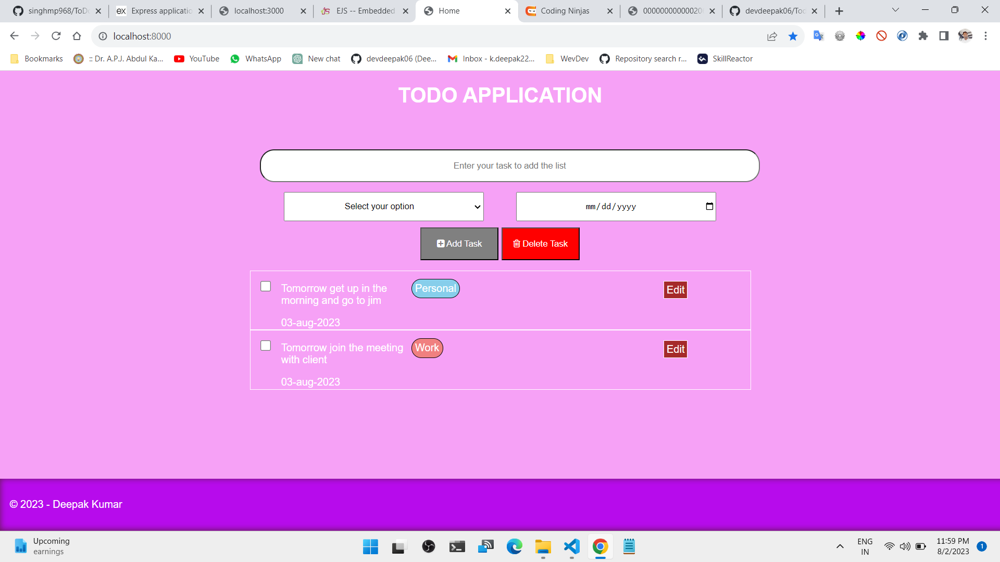
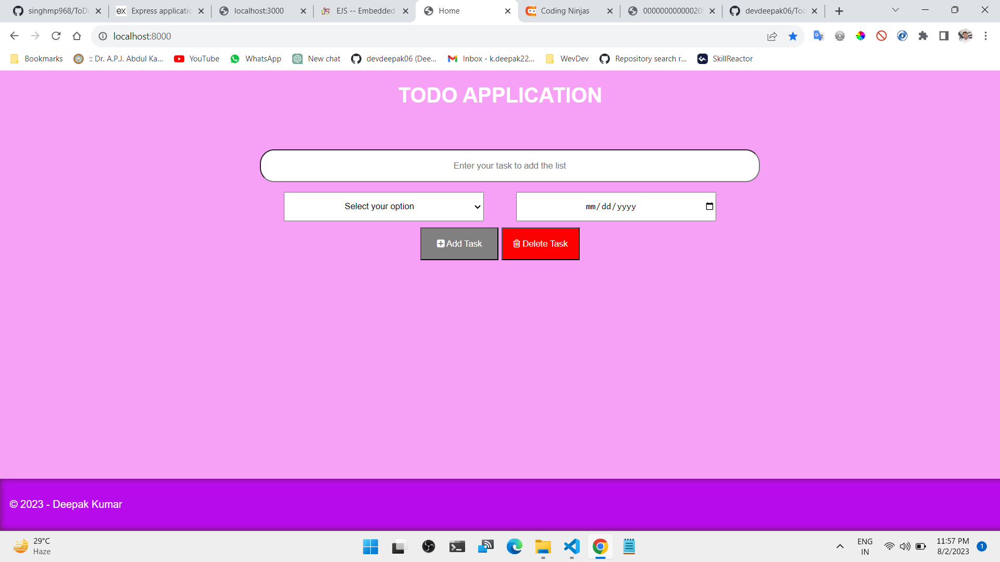

# To Do  List App

## Hello Everyone 👋 
This is a simple ToDo application using NodeJS and MongDB. where a user of this application can create,edit and delete all the ToDo items .

## How to use this application
- First of all you have to clone this repository in your local machine.
- Then you have to install all the dependencies by using the command `npm install`.
- Then you have to start the server by using the command `npm start`.
- Then you have to open the browser and type `localhost:8000` in the url bar.
- Then you can use this application.

## Table of contents

- [Overview](#overview)
  - [Screenshot](#screenshot)
- [My process](#my-process)
  - [Built with](#built-with)
  - [What I learned](#what-i-learned)
  - [Useful resources](#useful-resources)
- [Author](#author)
- [Acknowledgments](#acknowledgments)
- [Deploy Link](#deployed-link)

## Overview

It is a simple TODO application using NodeJS and MongDB. where a user of this application can create,edit and delete all the ToDo items .

### Screenshot

## My process

ToDo application is based on NodeJs and express as server side technology, MongoDb for Data-Base,and ejs fro front-end.  
### Built with

- HTML
- CSS
- JavaScript
- AJAX
- NodeJs
- express
- MongoDB
- ejs

### Useful Documentations

- [MongoDb](https://mongoosejs.com/)
- [expressJs](https://expressjs.com/)
- [NodeJs](https://nodejs.org/en/)
- [ejs](https://ejs.co/)

## Author

- LinkedIn - [Deepak Kumar](https://www.linkedin.com/in/deepak-kumar-62a76820b)

## Acknowledgments

This project is done by me from scratch by refering to the above websites .

## Deployed Link
-[TODO APP](https://google.com/)
